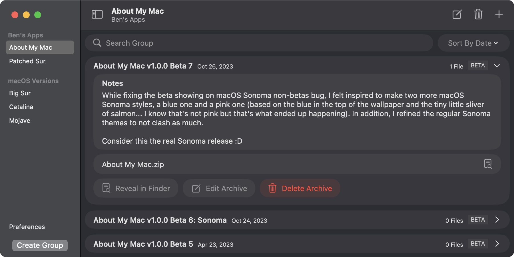

Archived is a simple Mac app for making file archives with some decent features, like sorting, tags, search stuff, etc. It's very rudimentary, so don't expect much, but give it a try if you're looking for a simple archival app.

## Installation
To install Archived, download the latest `.app` file from the GitHub releases page. Unzip the file, and drag the application to your Applications folder.

1. Navigate to the [Releases section](https://github.com/yourusername/archived/releases) of the project repository.
2. Download the latest release (`Archived.zip`).
3. Unzip the file and move `Archived.app` to your Applications folder.

### FAQ
Q: Why is it in beta?
A: Because it's I'm not sure what features I need to add from when I originally started it (or bugs that stand). This is an old project that has been revived.

Okay, I ran out of ideas. Give me questions.

## Support

This is GitHub, so you can use the Issues tab for Bugs/Feature Requests.

But... you can also join my [discord server](https://discord.gg/2DxVn4HDX6)!
